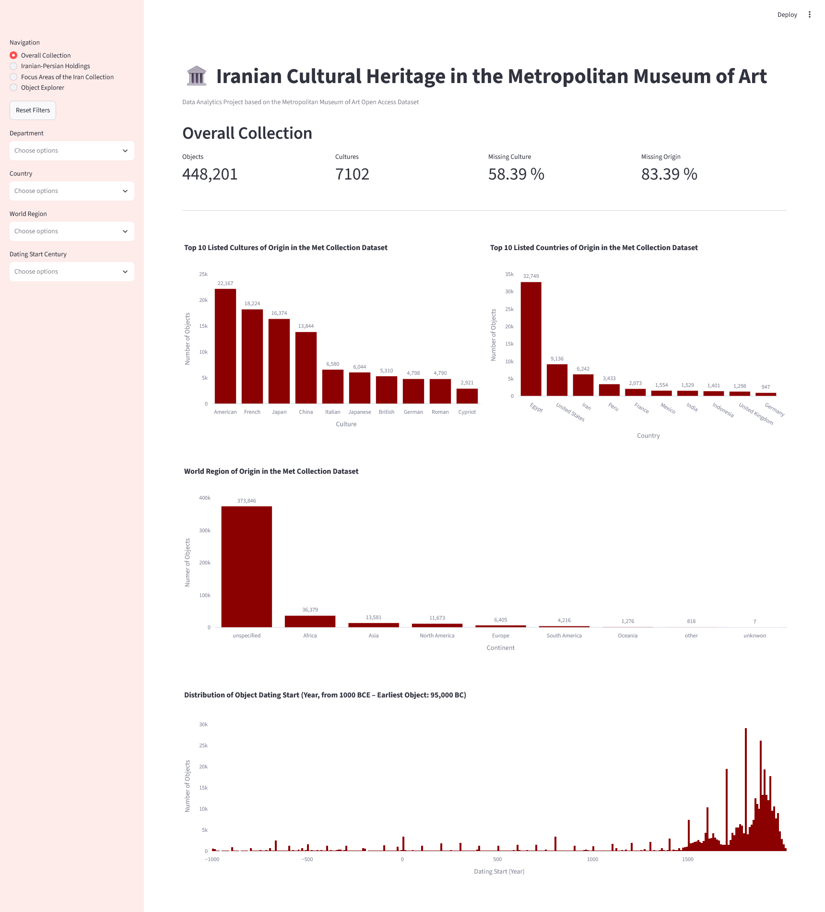
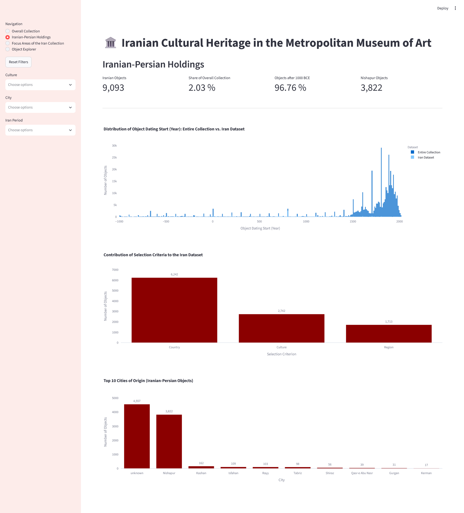
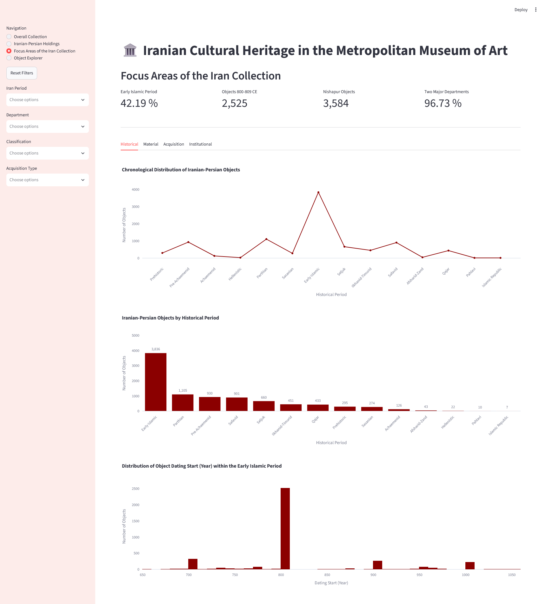
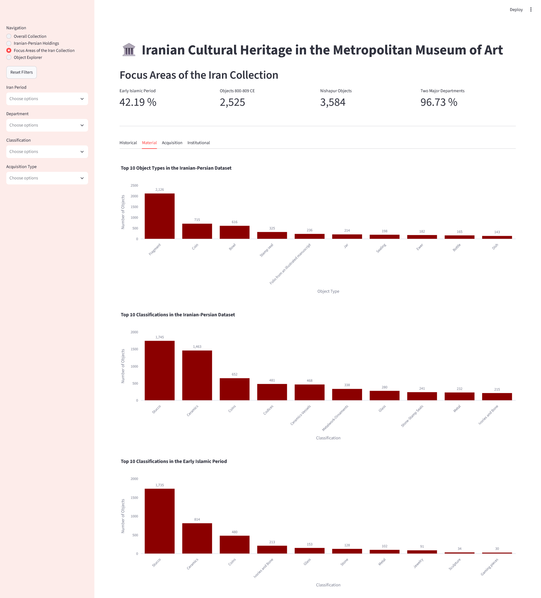
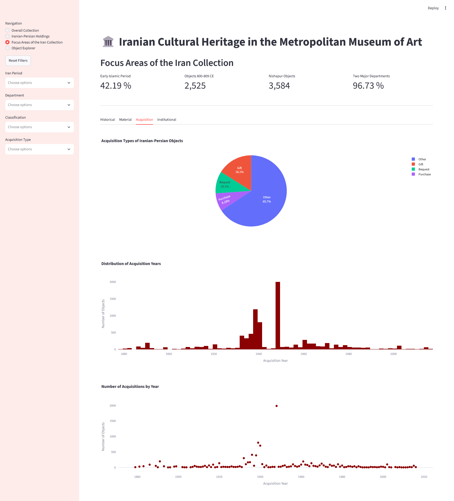
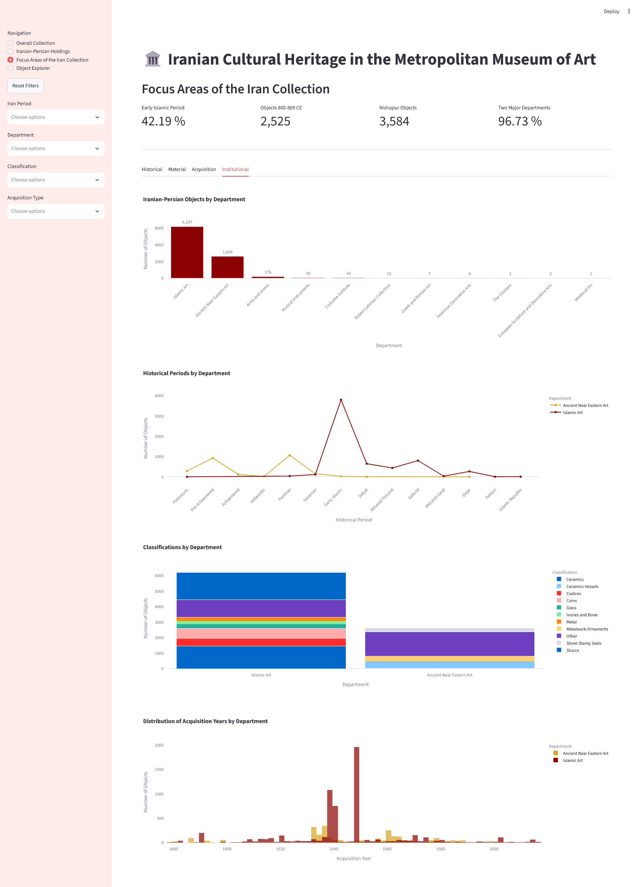
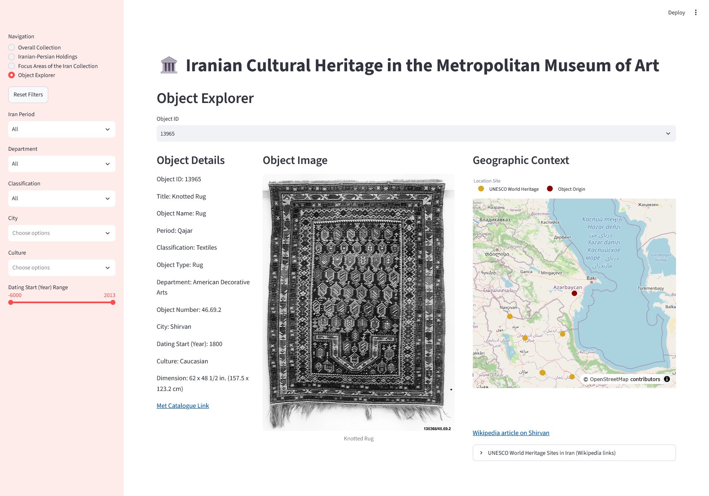

# Was sammelt ein Weltmuseum? – MET Iran Collection Analysis

Explorative und vertiefende Analyse der Sammlungsbestände des Metropolitan Museum of Art mit einer Fallstudie zum iranisch-persischen Kulturerbe.

## Projektbeschreibung

Dieses Projekt wurde als Abschlussprojekt des Moduls Python für Datenanalyse im Rahmen des Data Analyst Bootcamps bei DataSmart Point Academy durchgeführt.

Grundlage ist der Open-Access-Datensatz des Metropolitan Museum of Art (MetObjects.csv), der Metadaten zum gesamten Sammlungskatalog des Museums bereitstellt. Dieser Datensatz unter CC0-Lizenz wurde am 22.09.2026 bei Kaggle heruntergeladen: https://www.kaggle.com/datasets/metmuseum/the-metropolitan-museum-of-art-open-access.

Ziel des Projekts ist zunächst die datenbasierte Untersuchung der Gesamtsammlung hinsichtlich kultureller, geografischer und zeitlicher Schwerpunkte. Darauf aufbauend erfolgt eine vertiefte Fallstudie zu den iranisch-persischen Beständen des Museums.

Die Umsetzung erfolgte vollständig in Python mit Pandas und Plotly innerhalb eines Jupyter Notebooks und umfasst den kompletten Analyseprozess von der Exploration über die Datenbereinigung und das Feature Engineering bis hin zur analytischen Auswertung. Ergänzend wurde ein interaktives Dashboard mit Streamlit entwickelt, das die Ergebnisse visualisiert und um Daten aus der MET Collection API sowie Wikidata anreichert.

Das Metropolitan Museum of Art (Met) in New York gehört zu den größten und bedeutendsten Museen der Welt. Es wurde 1870 gegründet und beherbergt eine Sammlung von mehr als 1,5 Millionen Objekten von der Prähistorik bis in die modernste Zeit. Die Bestände umfassen Kunst- und Kulturgüter aus zahlreichen Regionen und Epochen der Welt und werden von spezialisierten kuratorischen Abteilungen betreut. Aufgrund ihrer Größe und Vielfalt eignet sich die Sammlung besonders für datenanalytische Untersuchungen kultureller, geografischer und zeitlicher Schwerpunkte.

## Projektziel

Die Analyse soll dabei helfen:

- Kulturelle, geografische und zeitliche Schwerpunkte der Gesamtsammlung zu identifizieren.
- Datenqualitätsprobleme des Sammlungsdatensatzes zu erkennen und zu bereinigen.
- Die Rolle der iranisch-persischen Bestände innerhalb der Sammlung einzuordnen.
- Zeitliche, materielle und institutionelle Schwerpunkte der iranischen Bestände herauszuarbeiten.
- Datenbasierte Handlungsempfehlungen abzuleiten.

## Leitfragen

### Übergeordnete Fragestellung

Welche Schwerpunkte prägen die Met-Sammlung – und was kennzeichnet die iranischen Bestände?

### Leitfrage 1

Welche kulturellen, geografischen und zeitlichen Schwerpunkte lassen sich in den Sammlungsbeständen des Metropolitan Museum of Art erkennen?

### Leitfrage 2

Welche Rolle spielen die iranischen Bestände innerhalb der Sammlung des Metropolitan Museum of Art?

### Leitfrage 3

Welche zeitlichen, materiellen und institutionellen Schwerpunkte weisen die iranischen Bestände auf?

## Datenbasis

Die Analyse basiert auf der Datei:

MetObjects.csv 

Der Datensatz enthält 448.203 Objekte mit 43 Attributen im Ausgangszustand, darunter u. a. Department, Culture, Country/Region, Datierung (Object Begin/End Date), Classification, Medium und Dimensions.

Es handelt sich um einen direkt vom Museum bereitgestellten Primärdatensatz mit Objektmetadaten des gesamten Sammlungskatalogs.

## Vorgehensweise

Das Projekt folgt dem klassischen Datenanalyseprozess:

1. Fragen und Problemstellung
2. Daten beschaffen
3. Explorative Datenanalyse (EDA)
4. Datenbereinigung
5. Feature Engineering
6. Analyse & Visualisierung (inkl. Streamlit-Dashboard)
7. Handlungsempfehlungen

Die Analyse erfolgte iterativ:

Exploration ↔ Datenbereinigung ↔ Analyse

Erkenntnisse aus der Exploration führten zu Bereinigungsentscheidungen. Analyseergebnisse machten vereinzelt weitere Bereinigungen erforderlich, etwa bei der Konstruktion des iranischen Teildatensatzes.

---

# Explorative Datenanalyse & Datenqualität

Im Rahmen der EDA wurden mehrere Datenqualitätsprobleme identifiziert:

- Object ID eindeutig, Object Number dagegen mit 2.576 versteckten Duplikaten.
- Culture (7.101) und Country (1.035) mit sehr hoher Vielfalt, teils vermischt oder mehrdeutig (z. B. „German, Innsbruck“, „Iran or Turkey“, teils bereits im Ausgangszustand mit Pipe-Werten wie „Iran|Iran“).
- Spalte Period mit über 80 % fehlenden Werten, kaum nutzbar.
- Object End Date mit zahlreichen nicht nachvollziehbaren bzw. nicht zuordenbaren Werten – für die Analyse unbrauchbar.
- Vereinzelte fehlerhafte Datierungen (u. a. zwei Jahreszahlen zu einer verschmolzen).

---

# Datenbereinigung

Durchgeführt wurden unter anderem:

- Reduktion auf die analyserelevanten Spalten (analysis_df): von 43 auf 13 Attribute.
- Fehlende Werte durch aussagekräftige Platzhalter ersetzt statt Zeilen zu löschen (z. B. Country → „unspecified“, Classification → „unclassified“).
- Zwei Objekte mit unplausiblen Jahresangaben entfernt, ein Datensatz korrigiert (verschmolzene Jahreszahl „18591861“ → 1859/1861).
- Classification: Mehrfachwerte (Trennzeichen „|“) auf die erste Kategorie reduziert.
- Object End Date vollständig verworfen – die Analyse basiert ausschließlich auf dem bereinigten Object Begin Date.

---

# Feature Engineering

Im Rahmen des Feature Engineerings wurden zusätzliche Variablen entwickelt.

**Country_Clean & World Region**
Sehr heterogene Herkunftsangaben wurden regelbasiert zu einheitlichen Ländern zusammengeführt (country_clean) und anschließend auf Weltregionen gemappt (world_region), um geografische Analysen auf Länder- und Kontinentebene zu ermöglichen.

**Begin Century**
Das Datierungsbeginnjahr (begin_year) wurde einem Jahrhundert zugeordnet.

**Acquisition Type & Acquisition Year**
Aus der Credit Line wurden Erwerbungsart (u. a. Gift, Purchase, Bequest, Transferred) und Erwerbungsjahr extrahiert.

**Teildatensatz Iran (iran_df)**
Für die vertiefende Fallstudie wurde ein eigener Teildatensatz konstruiert. „Iran“ wird dabei nicht nur als moderner Staat verstanden, sondern als iranisch-persischer Kulturraum: iran_df kombiniert country_clean == Iran, region == Iran sowie eine kuratierte Liste eindeutig iranisch-persischer Kulturangaben (u. a. Iranian, Persian, Achaemenid, Parthian, Sasanian, Qajar). Mehrdeutige Angaben wie „Iranian or Turkish“ wurden bewusst ausgeschlossen. Der resultierende Teildatensatz umfasst 9.093 Objekte.

**Iran Period**
Auf Basis von begin_year wurden die Objekte des iran_df mit der Funktion iran_period historischen Epochen und Dynastien der iranischen Geschichte zugeordnet (u. a. Achämeniden, Parther, Sasaniden, Safawiden, Qajaren, Pahlavi).

**Datenanreicherung (Dashboard)**
Für die Visualisierung im Dashboard wurde der Datensatz zusätzlich um Daten der MET Collection API (Objektbilder, Museums-Links) sowie um Geodaten und UNESCO-Welterbestätten aus Wikidata angereichert.

---

# Analyse 

Für die Beantwortung der drei Leitfragen wurden im Notebook fünf eigenständige Analysen durchgeführt, denen eine deskriptive Vor-Analyse des iranischen Teildatensatzes vorausging.

## Vor-Analyse: Deskriptive Prüfung von iran_df

- Deskriptive Prüfung der Datierung (begin_year, begin_century) des iran_df, auch zur möglichen iterativen Rückkopplung mit EDA und Datenbereinigung.
- Die frühesten Objekte reichen bis etwa 6000 v. Chr. (Neolithikum) zurück, machen jedoch nur einen sehr kleinen Teil der iranischen Bestände aus – der Schwerpunkt liegt deutlich auf späteren historischen Perioden.
- Genauere Prüfung der Kulturangabe „Iran": Diese wird im Datensatz überwiegend für vorislamische bzw. prähistorische Objekte verwendet und ist daher nicht ausschließlich als Hinweis auf iranisch-persische Kulturtraditionen zu verstehen, sondern häufig eher als geografische bzw. archäologische Zuordnung zum Gebiet des heutigen Iran. Kultur- und Datierungsangaben wurden deshalb im weiteren Verlauf stets gemeinsam betrachtet.

---

## Analyse 1: Überblick über die Gesamtsammlung

Ziel: Überblick über die Gesamtstruktur der Sammlung sowie Identifikation eines geeigneten Untersuchungsbereichs für die vertiefte Analyse.

- Bar-Diagramm „Top 10 Listed Cultures of Origin" (ohne unspecified): Am häufigsten dokumentiert sind American, French, Japan und China.
- Bar-Diagramm „Top 10 Cultures of Origin (%)" (inkl. unspecified): Bei über 58 % der Objekte fehlt die Kulturangabe – selbst American als größte dokumentierte Gruppe macht dadurch nur einen geringen Anteil aus.
- Bar-Diagramm „Top 10 Listed Countries of Origin" (ohne unknown): Egypt, United States und Iran sind die häufigsten dokumentierten Herkunftsländer.
- Bar-Diagramm „Top 10 Countries of Origin (%)" (inkl. unknown): Bei mehr als 83 % der Objekte fehlt die Herkunftsangabe – Egypt als häufigstes dokumentiertes Land macht dadurch weniger als 7 % der Gesamtbestände aus.
- Bar-Diagramm „World Region of Origin": kontinentaler Vergleich der dokumentierten Herkunftsangaben.
- Histogramm „Distribution of Object Dating Start (Year)" (ab 1000 v. Chr.): rechtsschiefe Verteilung mit klarem Schwerpunkt auf der Neuzeit, höchste Objektdichte im 18. bis frühen 20. Jahrhundert.
- Berechnung Erwerbungsart: Schenkungen (Gift) stellen mit rund 49 % den wichtigsten Erwerbungsweg dar, gefolgt von Other (31 %), Bequest (11 %) und Purchase (8 %).

**Ergebnis Analyse 1:** Die Sammlung zeichnet sich durch hohe kulturelle, geografische und zeitliche Vielfalt aus, weist aber deutliche Dokumentationslücken auf (Kultur fehlt bei rund 58 %, Herkunftsland bei rund 83 % der Objekte). Innerhalb der dokumentierten Kulturangaben dominieren American (4,95 %), French (4,07 %), Japanese (3,65 %) und Chinese (3,09 %); bei den Herkunftsländern Egypt (7,31 %), United States (2,04 %) und Iran (1,39 %), auf Kontinentebene Africa (8,12 %), Asia (3,03 %) und North America (2,60 %). Zeitlich reicht die Sammlung von der Vor- und Frühgeschichte bis in die Gegenwart, mit deutlichem Schwerpunkt auf dem 18. bis frühen 20. Jahrhundert. Aufgrund der Größe und Heterogenität der Gesamtbestände erfolgt die vertiefte Untersuchung im weiteren Verlauf anhand der iranisch-persischen Bestände.

---

## Analyse 2: Der iranisch-persische Kultur- bzw. Herkunftsraum im Kontext der Gesamtsammlung

Ziel: Einordnung der iranisch-persischen Bestände innerhalb der Gesamtstruktur des Museums sowie transparente Herleitung des Untersuchungsdatensatzes.

- Berechnung: Der Anteil von iran_df an der Gesamtsammlung beträgt rund 2 %.
- Histogramm-Overlay „Distribution of Object Dating Start (Year): Entire Collection vs. Iran Dataset": auffällig hoher Anteil iranisch-persischer Objekte im Zeitraum 800–809 n. Chr. (iran_period Early Islamic).
- Berechnung: 96,76 % von iran_df stammen aus der Zeit nach 1000 v. Chr. (analytische Zäsur, orientiert an der wissenschaftlichen Einwanderung indo-europäischer Gruppen auf das iranische Hochland).
- Bar-Diagramm „Contribution of Selection Criteria to the Iran Dataset": Country, Culture und Region tragen mit Mehrfachzuordnungen zur Konstruktion von iran_df bei, Country leistet den größten Beitrag.
- Prüfung der Region-Ausreißer, z. B. region == „Poland" (ein Rhyton aus sasanidischer Zeit ohne nachvollziehbaren Zusammenhang zur Zuordnung).
- Bereinigung der Spalte city (Dubletten wie „Nishapur|Nishapur", Zusätze wie „probably"/„possibly" vereinheitlicht, Mehrfachnennungen wie „Isfahan or Kashan" bewusst nicht zusammengeführt).
- Bar-Diagramm „Top 10 Cities of Origin (Iranian-Persian Objects)": Nishapur dominiert mit 3.822 Objekten, gefolgt von Kashan, Isfahan, Rayy und Tabriz; rund die Hälfte der Objekte besitzt keine dokumentierte Ortsangabe.

**Ergebnis Analyse 2:** iran_df umfasst 9.093 Objekte (rund 2 % der Gesamtsammlung) und wurde über die Kombination geografischer (country_clean, region) und kulturhistorischer (culture) Kriterien konstruiert. Die dokumentierten Ortsangaben konzentrieren sich auf wenige historische Zentren (Nishapur, Kashan, Isfahan, Rayy, Tabriz). 8.798 Objekte (96,76 %) stammen aus der Zeit nach 1000 v. Chr. und damit aus dem engeren Zeitraum der iranisch-persischen Geschichte – der Datensatz bildet damit eine ausreichend große und fachlich nachvollziehbar abgegrenzte Grundlage für die weiteren Analysen.

---

## Analyse 3: Zeitliche Schwerpunkte und historische Epochen

Ziel: Identifikation historischer Sammlungsschwerpunkte.

- Berechnung: Datierungen reichen von 6000 v. Chr. bis 2013 n. Chr.; Median 800 n. Chr.
- Verteilung nach iran_period: Early Islamic Period mit 3.836 Objekten mit Abstand größte Gruppe.
- Bar-Diagramm „Iranian-Persian Objects by Dating Start Century" (gesamt): zeigt große zeitliche Variabilität, aber unübersichtlich.
- Bar-Diagramm „…(without Prehistoric Period)": die meisten Objekte stammen aus dem 8. Jahrhundert.
- Berechnung: Das 8. Jahrhundert dominiert mit über 30 % von iran_df; auffällig auch ein relativ großer Anteil aus dem 9. Jahrhundert v. Chr.
- Liniendiagramm „Chronological Distribution of Iranian-Persian Objects" (nach Epoche, historisch geordnet): stark ungleichmäßige Verteilung über die Epochen.
- Bar-Diagramm „Iranian-Persian Objects by Historical Period" (absteigend): Early Islamic (3.836), Parthian (1.105), Pre-Achaemenid (930).
- Bar-Diagramm „…by Historical Period (%)": Early Islamic macht 42,19 % aus; Early Islamic, Parthian und Pre-Achaemenid vereinen zusammen über 60 % von iran_df.
- Histogramm „Distribution of Object Dating Start (Year) within the Early Islamic Period": starke Konzentration auf das Jahrzehnt 800–809 n. Chr. mit rund 2.525 Objekten.

**Ergebnis Analyse 3:** Die Bestände decken 6000 v. Chr. bis 2013 n. Chr. ab, konzentrieren sich aber stark auf wenige Kernperioden. Early Islamic Period (3.836 Objekte / 42,19 %) ist mit Abstand der wichtigste Sammlungsschwerpunkt, daneben sind Parthian, Pre-Achaemenid und Safavid stark vertreten. Innerhalb der Early Islamic Period entfallen 2.525 Objekte allein auf das Jahrzehnt 800–809 n. Chr. Bemerkenswert: Die Parther (1.105 Objekte) sind stärker vertreten als die öffentlich bekannteren Achämeniden (126) und Sasaniden (274).

---

## Analyse 4: Materielle und funktionale Zusammensetzung

Ziel: Analyse der materiellen und funktionalen Zusammensetzung der iranisch-persischen Bestände.

- object_name: insgesamt 679 verschiedene Objektarten.
- Bar-Diagramm „Top 10 Object Types": Fragmente dominieren mit über 2.100 Objekten, daneben Münzen, Schalen und Siegel.
- Bar-Diagramm „Top 10 Classifications": Stuckobjekte und Keramik dominieren mit zusammen über 3.200 Objekten, daneben Münzen, Manuskripte und Gefäßformen.
- Bar-Diagramm „Top 10 Classifications in the Early Islamic Period": Stucco (1.735 Objekte) trägt die Dominanz der Periode nahezu allein – das entspricht fast der Gesamtzahl aller Stuckobjekte in iran_df (1.745).
- Histogramm „Distribution of Stucco Objects within the Early Islamic Period": Von den 1.735 Stucco-Objekten werden 1.721 auf das Jahrzehnt 800–809 n. Chr. datiert.
- city-Auswertung für Stucco/Early Islamic: städtischer Schwerpunkt auf Nishapur.
- city-Auswertung für die gesamte Early Islamic Period: Von 3.836 Objekten stammen 3.584 aus Nishapur (93,43 %) – zeitlicher, materieller und räumlicher Schwerpunkt fallen damit zusammen.
- medium: 2.051 verschiedene Material-/Technikangaben, geprägt vor allem von Stuck-, Keramik- und Metallobjekten.
- Kreisdiagramm „Acquisition Types of Iranian-Persian Objects": Other dominiert mit knapp zwei Dritteln, gefolgt von Gift (16,1 %), Bequest (10,1 %) und Purchase (8,2 %) – deutlich anders als bei der Gesamtsammlung.
- Tabelle der dominierenden Klassifikation je Periode: Early Islamic → Stucco (45,23 %), Parthian → Clay-Sealings (18,01 %), Sasanian → Münzen (36,13 %), Safavid/Qajar → Codices (Handschriften).
- describe() Erwerbungsjahr: ältestes bekanntes Erwerbungsjahr 1879, jüngstes 2013.
- Histogramm „Distribution of Acquisition Years": mehrere Erwerbungswellen, stärkster Schwerpunkt 1948/1949 mit über 2.000 Objekten.
- Streudiagramm „Number of Acquisitions by Year": Spitzenjahre 1939/1940 sowie 1948/1949; 1948 allein 1.982 Objekte – der stärkste Einzelzugang des gesamten Datensatzes.

**Ergebnis Analyse 4:** Die Bestände werden materiell von Fragmenten, Keramik, Stuckobjekten, Münzen und Handschriften geprägt; Stucco und Ceramics vereinen zusammen mehr als ein Drittel aller Objekte. Der Sammlungsschwerpunkt im Jahrzehnt 800–809 n. Chr. (Analyse 3) erklärt sich direkt durch die hohe Zahl frühislamischer Stuckobjekte, die zudem räumlich stark auf Nishapur konzentriert sind (93,43 % der Early-Islamic-Bestände). Jede Epoche wird durch eine eigene materielle Tradition geprägt (Clay-Sealings bei den Parthern, Münzen bei den Sasaniden, Codices bei Safawiden/Qajaren). Die Erwerbungsgeschichte zeigt deutliche Wellen, insbesondere vor dem Kriegseintritt der USA sowie 1948/1949.

---

## Analyse 5: Institutionelle Schwerpunkte und Muster

Ziel: Untersuchung institutioneller Sammlungsschwerpunkte und Identifikation struktureller Muster innerhalb der iranisch-persischen Bestände.

- department-Verteilung sowie Prüfung, ob eine Korrelationsmatrix sinnvoll ist (verworfen, da numerische Werte zu eingeschränkt).
- Bar-Diagramm „Iranian-Persian Objects by Department": Islamic Art (6.187 Objekte) und Ancient Near Eastern Art (2.609 Objekte) dominieren deutlich; Berechnung bestätigt, dass beide Departments zusammen rund 97 % von iran_df verwalten.
- Gestapeltes Bar-Diagramm „Classifications by Department": Islamic Art wird durch mehrere Top-Klassifikationen geprägt, Ancient Near Eastern Art dagegen stärker durch die Sammelkategorie „Other" (also breiter über seltenere Klassifikationen gestreut).
- Boxplot „Department Islamic Art: Total Collection vs. Iranian-Persian Objects": Median der iranischen Bestände (800 n. Chr.) liegt unter dem Gesamtmedian der Abteilung (1000 n. Chr.); ein iranischer Ausreißer um 5000 v. Chr.
- Boxplot „Department Ancient Near Eastern Art: Total Collection vs. Iranian-Persian Objects": Median des Gesamtbestands rund 900 v. Chr., iranischer Teilbestand mit jüngerem Median (487 v. Chr.).
- Liniendiagramm „Historical Periods by Department": Ancient Near Eastern Art konzentriert sich auf vorislamische Epochen, Islamic Art fast vollständig auf islamische und frühneuzeitliche Perioden.
- describe() Erwerbungsjahre je Department: ähnliche Mediane um die Mitte des 20. Jahrhunderts; Islamic Art stärker auf die 1940er-Jahre gebündelt, Ancient Near Eastern Art mit größerer Streuung bis in die zweite Jahrhunderthälfte.
- Histogramm-Overlay „Distribution of Acquisition Years by Department": beide Departments mit Erwerbungswellen bereits in den späten 1930er-Jahren; die stärksten Spitzen (1938–1940, 1948–1949) entfallen überwiegend auf Islamic Art, während Ancient Near Eastern Art gleichmäßiger zum Bestandsaufbau der folgenden Jahrzehnte beiträgt.

**Ergebnis Analyse 5:** Die Bestände konzentrieren sich institutionell nahezu vollständig auf Islamic Art und Ancient Near Eastern Art (zusammen rund 97 % von iran_df), mit klarer historischer Arbeitsteilung: Ancient Near Eastern Art für die vorislamischen, Islamic Art für die islamischen und frühneuzeitlichen Epochen. Auch die Erwerbungsgeschichte unterscheidet sich – die großen Erwerbungswellen (v. a. 1948/1949) gehen überwiegend auf Islamic Art zurück, während Ancient Near Eastern Art einen gleichmäßigeren Bestandsaufbau zeigt, u. a. während der Pahlavi-Zeit.

---

# Beantwortung der Leitfragen

Diese fünf Analysen dienten der Beantwortung der drei Leitfragen; die Ergebnisse wurden entsprechend aufgeteilt und später ebenso für die drei Dashboard-Bereiche (Overall Collection, Iranian-Persian Holdings, Focus Areas of the Iran Collection) übernommen.

### Leitfrage 1: Welche kulturellen, geografischen und zeitlichen Schwerpunkte lassen sich in den Sammlungsbeständen des Metropolitan Museum of Art erkennen? (Analyse 1)

Die Sammlung weist mehr als 7.000 Kulturangaben und über 1.000 Herkunftsangaben auf und besitzt damit eine außergewöhnlich hohe kulturelle und geografische Diversität. Unter den dokumentierten Kulturangaben dominieren insbesondere amerikanische, französische, japanische und chinesische Objekte, bei den Herkunftsländern vor allem Ägypten, die Vereinigten Staaten und Iran.

Gleichzeitig zeigen die Metadaten erhebliche Dokumentationsprobleme: Für rund 58 % der Objekte fehlt eine Kulturangabe, für etwa 83 % eine Herkunftsangabe. Die geografischen Schwerpunkte können daher nur auf Basis des dokumentierten Teilbestands bestimmt werden.

Zeitlich reicht die Sammlung von der Vor- und Frühgeschichte bis in die Gegenwart. Die höchste Objektdichte liegt jedoch eindeutig auf der Neuzeit, insbesondere auf dem 18. bis frühen 20. Jahrhundert.

### Leitfrage 2: Welche Rolle spielen die iranischen Bestände innerhalb der Sammlung des Metropolitan Museum of Art? (Analyse 2)

Der definierte Iran-Datensatz (iran_df) umfasst 9.093 Objekte und entspricht rund 2 % der Gesamtbestände des Museums. Trotz dieses vergleichsweise kleinen Anteils bildet er einen außergewöhnlich großen und historisch breit angelegten Teilbestand.

Die Konstruktion des Datensatzes erforderte die Kombination geografischer (country_clean, region) und kulturhistorischer (culture) Selektionskriterien. Dabei zeigte sich, dass zahlreiche relevante Objekte nicht über die Herkunftsangaben, sondern erst über regionale und kulturelle Attribute identifiziert werden konnten.

Besonders auffällig ist die starke Präsenz iranisch-persischer Objekte im frühen 9. Jahrhundert n. Chr. Von den 9.093 Objekten stammen 8.798 Objekte (96,76 %) aus der Zeit nach 1000 v. Chr. und damit aus dem engeren Zeitraum der iranisch-persischen Geschichte.

### Leitfrage 3: Welche zeitlichen, materiellen und institutionellen Schwerpunkte weisen die iranischen Bestände auf? (Analyse 3, 4 & 5)

Die zeitliche Analyse zeigt eine starke Konzentration auf wenige historische Kernperioden: Die Early Islamic Period umfasst allein 3.836 Objekte bzw. 42,19 % des gesamten Iran-Datensatzes. Daneben sind insbesondere die Parther-, vorachämenidischen und sasanidischen Perioden stark vertreten. Innerhalb der Early Islamic Period konzentrieren sich die Bestände außergewöhnlich stark auf das Jahrzehnt 800–809 n. Chr. mit 2.525 Objekten – dieser Schwerpunkt prägt die gesamte zeitliche Struktur des Iran-Datensatzes.

Materiell und funktional werden die Bestände von Fragmenten, Keramik, Stuckobjekten, Münzen und Handschriften dominiert. Besonders hervorzuheben ist die Klassifikation Stucco mit 1.745 Objekten, der größten Einzelgruppe: Von den 1.735 Stucco-Objekten der Early Islamic Period werden 1.721 auf das Jahrzehnt 800–809 n. Chr. datiert. Räumlich konzentriert sich die Early Islamic Period zudem stark auf Nishapur: Von den 3.836 Objekten dieser Epoche entfallen 3.584 (93,43 %) auf diese Stadt. Die zeitliche, materielle und räumliche Konzentration der Bestände fällt damit in bemerkenswerter Weise zusammen.

Institutionell konzentrieren sich die Bestände nahezu vollständig auf die Departments Islamic Art und Ancient Near Eastern Art, die zusammen rund 97 % aller iranisch-persischen Objekte verwalten. Dabei zeigt sich eine klare historische Arbeitsteilung: Ancient Near Eastern Art konzentriert sich auf die vorislamischen Epochen, Islamic Art vor allem auf die islamischen und frühneuzeitlichen Perioden.

Auch die Erwerbungsgeschichte weist deutliche Schwerpunktphasen auf: starke Erwerbungswellen unmittelbar vor dem Kriegseintritt der USA in den Zweiten Weltkrieg sowie in den Jahren 1948 und 1949 (1948 allein 1.982 Objekte, der stärkste Einzelzugang des gesamten Datensatzes). Der anschließende Bestandsaufbau während der Pahlavi-Zeit erfolgt deutlich kontinuierlicher und auf niedrigerem Niveau (provinienzhistorisch auch für Leitfrage 2 von Interesse).

---

## Dashboard

Zur interaktiven Visualisierung der Ergebnisse wurde mit Streamlit ein Dashboard entwickelt (dashboard.py) mit vier Bereichen:

- **Overall Collection** – Kennzahlen und Diagramme zur Gesamtsammlung, filterbar nach Department, Land, Weltregion und Jahrhundert.
- **Iranian-Persian Holdings** – Einordnung des iranischen Teildatensatzes in die Gesamtsammlung.
- **Focus Areas of the Iran Collection** – vertiefte Auswertung nach Zeit, Material, Erwerbung und Institution (inkl. Departmentvergleich).
- **Object Explorer** – Detailansicht einzelner Objekte: Objektinformationen direkt aus dem Datensatz (u. a. Object Name, Period, Classification, Department, City, Culture), ergänzt um Object Number, Met Catalogue Link und Objektbild aus der MET Collection API. Geografische Einordnung über eine interaktive OpenStreetMap-Karte (Plotly, Wikidata-Geokodierung), die den Objektstandort gemeinsam mit allen iranischen UNESCO-Welterbestätten (Wikidata SPARQL) darstellt, inkl. Wikipedia-Links zur Objektstadt und zu allen Welterbestätten.

Die im Dashboard verwendeten Diagramme und Kennzahlen (KPIs) sind eine Auswahl der im Notebook zur Beantwortung der Leitfragen genutzten Analysen. Die Diagrammtitel erscheinen im Dashboard lediglich linksbündig statt zentriert und optisch fett, um dem Design des Dashboards gerecht zu werden.

## Zentrale Erkenntnis

Die iranisch-persischen Bestände des Metropolitan Museum of Art sind klein im Anteil, bilden jedoch einen historisch, materiell und institutionell klar strukturierten Sammlungsschwerpunkt. Gleichzeitig zeigt die Analyse deutliche Dokumentationslücken in der Gesamtsammlung, insbesondere bei Kultur- und Herkunftsangaben.

---

## Handlungsempfehlungen

**Metadatenqualität nachhaltig verbessern**
Kultur- und Herkunftsangaben systematisch verbessern – bestehende Lücken nachtragen und verbindliche Erfassungsstandards für künftige Neuzugänge einführen.

**Iranische Bestände erschließen**
Teilbestand eigenständig als Forschungsschwerpunkt ausweisen, provenienzhistorisch untersuchen und gezielt zugänglich machen.

**Early Islamic Period hervorheben**
Frühislamische Stuckobjekte als zentralen Sammlungsschwerpunkt in Forschung, Digitalisierung und Vermittlung hervorheben.

---

## Eingesetzte Python-Konzepte und -Techniken

Im Projekt kamen unter anderem folgende Konzepte und Techniken zum Einsatz:

- Pandas DataFrames.
- CSV-Import und CSV-Export.
- Datenexploration (`info()`, `describe()`, `value_counts()`, `isna()`).
- Duplikaterkennung (`duplicated()`).
- Umgang mit fehlenden Werten (`fillna()`, `dropna()`).
- String-Manipulation und reguläre Ausdrücke (`str.replace`, `str.contains`, `str.split`, `str.strip` mit Regex).
- Mapping- und Ersetzungslogik über Dictionaries (`replace()`, `map()`).
- Boolesche Filterung und bedingte Zuweisung (`loc`, Boolesche Masken).
- Benutzerdefinierte Funktionen (u. a. `begin_century`, `iran_period`).
- Gruppierungen und Aggregationen (`groupby()`, `agg()`).
- Zusammenführen von DataFrames (`merge`, `concat`).
- Datenvisualisierung mit Plotly Express (Balken-, Linien-, Kreis- und Streudiagramme, Histogramme).
- Prüfung einer Korreltationsberechnung (Ausschluss einer Korrelationsmatrix, nummerische Werte nicht geeignet).
- Export bereinigter/abgeleiteter Datensätze als CSV für die Weiterverwendung im Dashboard.
- Dashboard bzw. interaktive Web-Anwendung mit Streamlit (Caching, Sidebar-Filter, Tabs, Metrics, interaktive Karten, Tooltip).
- Anbindung externer APIs (MET Collection API, Wikidata SPARQL-Endpoint) über `requests`.

---

## Dashboard Screenshots

### 1. Overall Collection

### 2. Iranian-Persian Holdings

### 3. Focus Areas – Historical

### 4. Focus Areas – Material

### 5. Focus Areas – Acquisition

### 6. Focus Areas – Institutional

### 7. Object Explorer

---

## Repository-Inhalt

- `main.ipynb` – Jupyter Notebook mit dem vollständigen Analyseprozess.
- `dashboard.py` – Streamlit-Dashboard zur interaktiven Visualisierung.
- `Dennis_Abschlusspräsentation_MET-Iran_Python.pptx` – Abschlusspräsentation.

---

## Autor

Dennis Theiß

Python-Abschlussprojekt – Data Analyst Bootcamp

DataSmart Point Academy

September 2026
